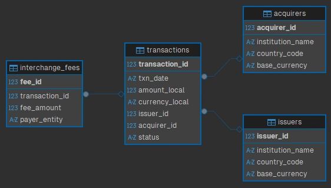

# Settlement Engine

The code in this repository goes along with my blog post, [Modeling a
Multi-Currency Settlement
Engine](https://travishorn.com/modeling-a-multi-currency-settlement-engine).

## Setup

Create a new SQLite database called `local.db`.

Execute the `CREATE TABLE` statements in [schema.sql](./schema.sql) to set up
the database.



Install the Faker library for Python.

```console
pip install faker
```

Execute the [seed.py](./seed.py) to insert fake generated data into the
database.

```console
python seed.py
```

Consider this user story:

> **As a** Product Strategist, **I want** to see the day-over-day growth percentage
of transaction volue per acquirer, **so that** I can identify which institutions
are driving platform growth and offer them incentives.

And this acceptance criteria:

1. Verify calculation of Daily Volume = Sum of `amount_local` where `status` =
   `'SETTLED'`.
2. Verify the report ranks acquirers by total volume per day (rank 1 is the
   highest).
3. Verify the report calculates the percentage difference between the current
   day and previous day's volume.

The SQL query in [acquirer_performance.sql](./acquirer_performance.sql)
satisfies these.

## License

The MIT License

Copyright 2026 Travis Horn

Permission is hereby granted, free of charge, to any person obtaining a copy of
this software and associated documentation files (the “Software”), to deal in
the Software without restriction, including without limitation the rights to
use, copy, modify, merge, publish, distribute, sublicense, and/or sell copies of
the Software, and to permit persons to whom the Software is furnished to do so,
subject to the following conditions:

The above copyright notice and this permission notice shall be included in all
copies or substantial portions of the Software.

THE SOFTWARE IS PROVIDED “AS IS”, WITHOUT WARRANTY OF ANY KIND, EXPRESS OR
IMPLIED, INCLUDING BUT NOT LIMITED TO THE WARRANTIES OF MERCHANTABILITY, FITNESS
FOR A PARTICULAR PURPOSE AND NONINFRINGEMENT. IN NO EVENT SHALL THE AUTHORS OR
COPYRIGHT HOLDERS BE LIABLE FOR ANY CLAIM, DAMAGES OR OTHER LIABILITY, WHETHER
IN AN ACTION OF CONTRACT, TORT OR OTHERWISE, ARISING FROM, OUT OF OR IN
CONNECTION WITH THE SOFTWARE OR THE USE OR OTHER DEALINGS IN THE SOFTWARE.
